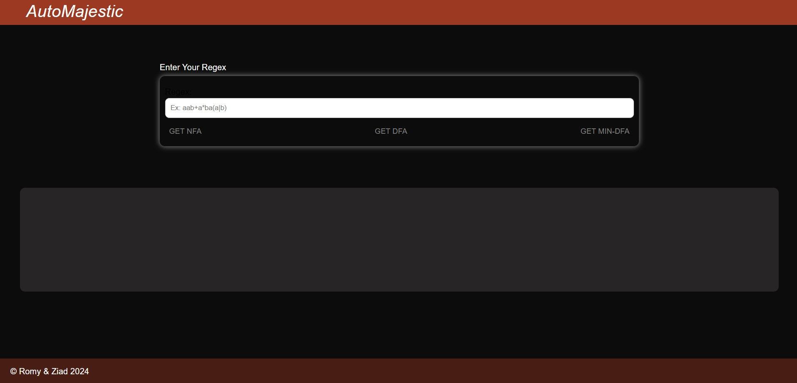
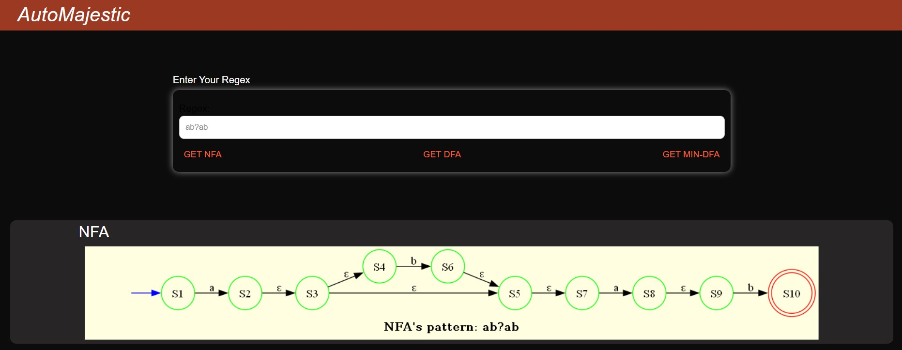
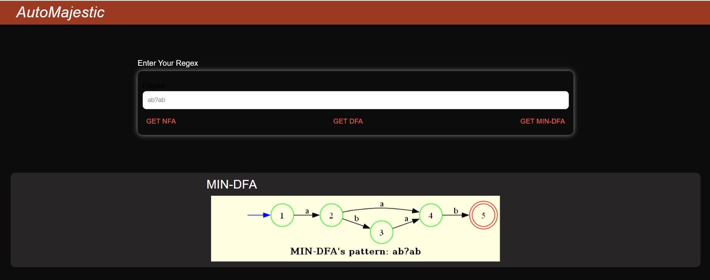
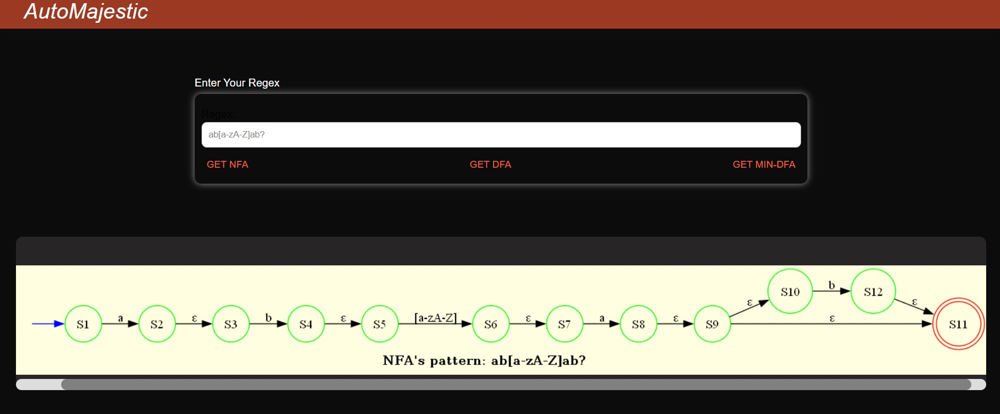
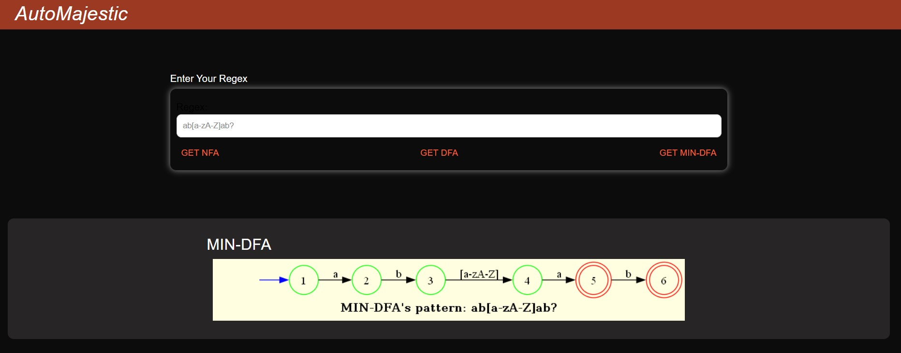
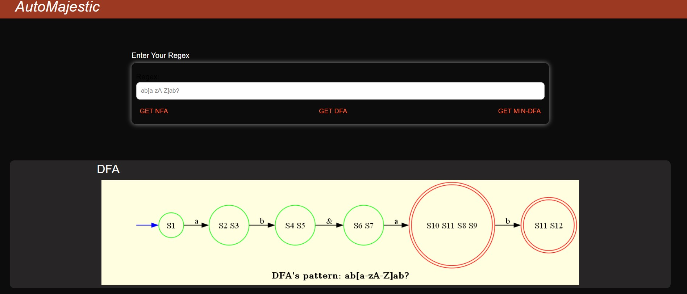
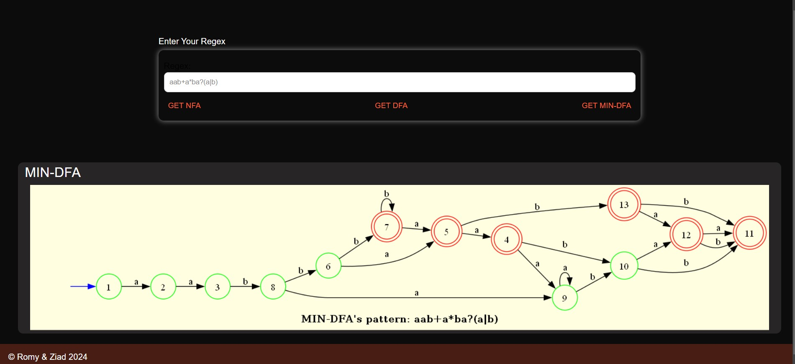

# AutoMajestic
<div align="center">

</div>

<div align="center">

[](https://github.com/ZiadSheriif/AutoMajestic/contributors)
[](https://github.com/ZiadSheriif/AutoMajestic/issues)
[](https://github.com/ZiadSheriif/AutoMajestic/blob/master/LICENSE)
[](https://github.com/ZiadSheriif/AutoMajestic/network)
[](https://github.com/ZiadSheriif/AutoMajestic/stargazers)
[](https://img.shields.io/github/languages/count/ZiadSheriif/AutoMajestic)

</div>


## 📝 Table of Contents

- [AutoMajestic](#automajestic)
  - [📝 Table of Contents](#-table-of-contents)
  - [📙 About ](#-about-)
  - [🌠 Features ](#-features-)
  - [📂 Folder Structure ](#-folder-structure-)
  - [📸 Demo Screens ](#-demo-screens-)
  - [Setup](#setup)
    - [Download and Install Graphviz](#download-and-install-graphviz)
    - [Install Python Requirements](#install-python-requirements)
    - [Install Node.js and npm](#install-nodejs-and-npm)
    - [Running the Application](#running-the-application)
      - [Start the Flask Server](#start-the-flask-server)
      - [Start the React Application](#start-the-react-application)
  - [🕴 Contributors ](#-contributors-)
  - [📃 License ](#-license-)

## 📙 About <a name = "about"></a>

AutoMajestic is an innovative application designed to empower users with the ability to visualize and comprehend complex automata structures such as NFA (Nondeterministic Finite Automata) , DFA (Deterministic Finite Automata) and finally Minimized DFA With its intuitive interface and robust features

## 🌠 Features <a name= "features"></a>
1. Ability to create and visualize automata, NFA, DFA, MIN-DFA.
2. Interactive and user-friendly interface.
3. Detailed explanations and step-by-step walkthroughs.

## 📂 Folder Structure <a name= "folder-structure"></a>

```sh
├───dfafrontend
│   ├───public
│   └───src
│       ├───components
│       └───pages
└───src
    ├───dfa
    ├─── min_dfa
    │   ├───min_dfa
    │   ├───nfa
    │   ├───regex_processor
    │   ├───regex_validator
    │   └───state
    └───utils
         └───helpers
```

## 📸 Demo Screens <a name = "screens"></a>

<div align="center">

   
   




</div>


## Setup

### Download and Install Graphviz

1. Download the Graphviz library from [this link](https://gitlab.com/graphviz/graphviz/-/package_files/6164164/download).
2. Unzip the downloaded file.
3. Follow the installation instructions provided with the library.

### Install Python Requirements

1. Make sure you have Python installed on your machine. You can download Python from [here](https://www.python.org/downloads/).
2. Install the required Python packages by running the following command in your terminal:

```bash
pip install -r requirements.txt
```


### Install Node.js and npm
1. Make sure you have Node.js and npm installed on your machine. You can download Node.js and npm from here.
2. Navigate to the **dfafrontend** directory and install the required Node.js packages by running the following command in your terminal:

```sh
cd dfafrontend
npm install
```

### Running the Application

#### Start the Flask Server

1. Navigate to the project root directory.
2. Run the following command in your terminal to start the Flask server:
   
```sh
$ python app.py
```

#### Start the React Application

1. Navigate to the dfafrontend directory.
2. Run the following command in your terminal to start the React application:
   
```sh
$ npm start
```

> The React application will now be running at http://localhost:3000, and the Flask server will be running at http://localhost:5000.


## 🕴 Contributors <a name = "Contributors"></a>

<table style="width: 100%;">
  <tr style="display: flex; justify-content: space-evenly;">
    <td align="center">
      <a href="https://github.com/ZiadSheriif" target="_black">
        
        <br />
        <sub><b>Ziad Sherif</b></sub>
      </a>
    </td>
    <td align="center">
      <a href="https://github.com/mohamedromee12" target="_black">
        
        <br />
        <sub><b>Mohamed Rome</b></sub>
      </a>
    </td>
  </tr>
</table>

 

 ## 📃 License <a name = "license"></a>

> This software is licensed under MIT License, See [License](https://github.com/ZiadSheriif/Todo-List/blob/main/LICENSE) for more information @AutoMajestic.